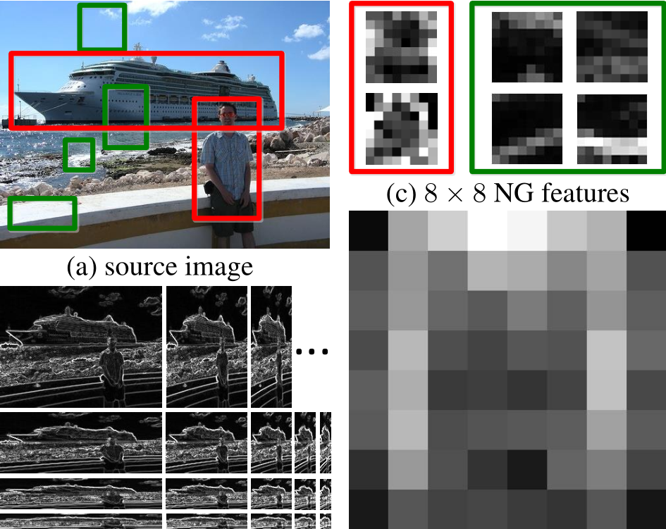

Objectness Proposal Generator with BING

[](http://opensource.org/licenses/BSD-3-Clause)

==========
BING Objectness proposal estimator Linux Ubuntu 14.04/Mac OSX Yosemite/iOS 8.1 version implementation, 
runs at 1000 FPS at a Dell 7600 workstation with Linux Ubuntu 14.04.



## INSTALL
To make this program running fast, you need to enable release mode: 
> cmake -DCMAKE_BUILD_TYPE=Release ../

## DEMO
If you run this in Ubuntu 14.04 or other similar Linux system, feel free to 
change the path in main.cpp
> DataSetVOC voc2007("YOUR_PATH_TO_THE_VOC2007DATA");

Notice that WinRecall.m is generated by this code, you do not need them. If you
want to make this code working with other datasets, one simple solution is to 
make the folders similar to the VOC 2007 one.

## Introduction
This is the 1000 FPS BING objectness linux version library for efficient 
objectness proposal estimator,We would appreciate if you could cite and refer to 
the papers below.
```
@inproceedings{BingObj2014,
  title={{BING}: Binarized Normed Gradients for Objectness Estimation at 300fps},
  author={Ming-Ming Cheng and Ziming Zhang and Wen-Yan Lin and Philip H. S. Torr},
  booktitle={IEEE CVPR},
  year={2014},
}
```
```
@inproceedings{depthobjectproposals_GCPR2015, 
author = {Shuai Zheng and Victor Adrian Prisacariu and Melinos Averkiou and Ming-Ming Cheng and Niloy J. Mitra and Jamie Shotton and Philip H. S. Torr and Carsten Rother}, 
title = {Object Proposal Estimation in Depth Images using Compact 3D Shape Manifolds}, 
booktitle = {German Conference on Pattern Recognition (GCPR)},
year = {2015} 
}
```
The original author Ming-Ming Cheng has already released the source code for 
windows 64-bit platform. In this library, we intend to release the code for the 
linux/mac/iOS users. You can maintain the code with Qt Creator IDE.

Please find the original windows code / FAQ / Paper from this link:
http://mmcheng.net/bing/

## FAQ
In order to make the code running as the original version in windows, you need
to download the images/annotations PASCAL VOC 2007 data from the website.
(http://pascallin.ecs.soton.ac.uk/challenges/VOC/voc2007/#testdata)

We have tested the code, it produces the same accuracy results as the original windows
version, while it runs at 1111 FPS(frame per second) at Ubuntu 12.04 with a Dell T7600 
workstation computer, which has two Intel Xeon E5-2687W (3.1GHz, 1600MHz) and 64 GB 
1600MHz DDR3 Memory.

## Author Info
Author: Ming-Ming Cheng removethisifyouarehuman-cmm.thu@gmail.com
Linux Author: Shuai Zheng (Kyle) removethisifyouarehuman-szhengcvpr@gmail.com
Please find more information from http://kylezheng.org/objectproposal/
Date: 19, February 

